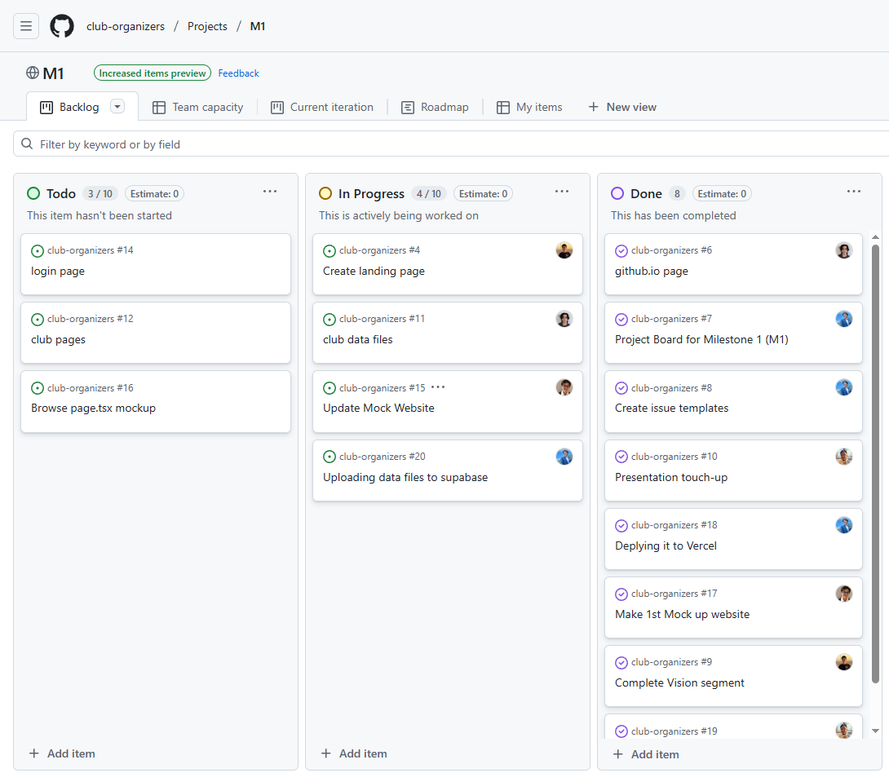
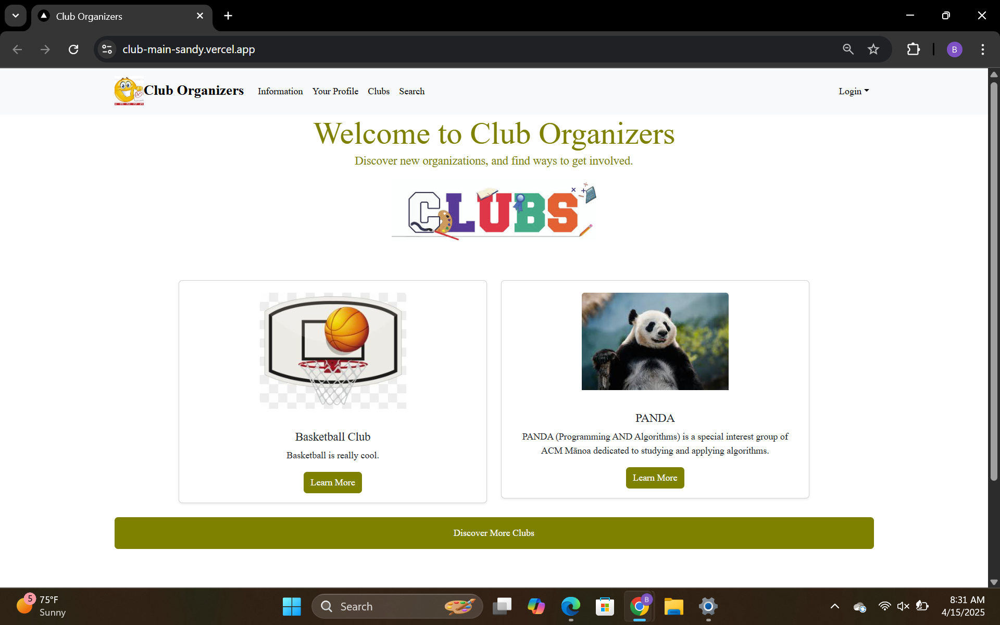
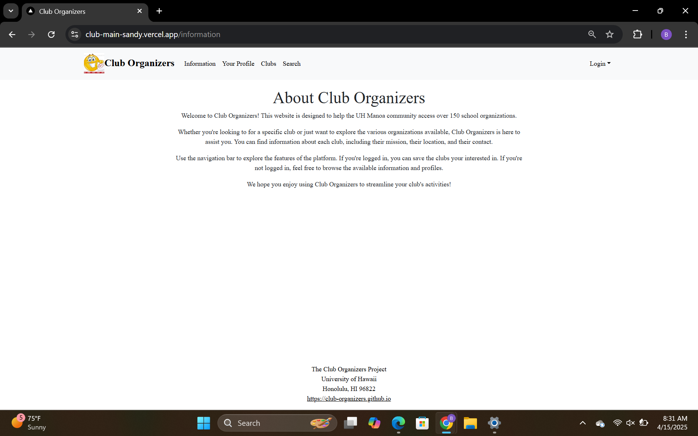
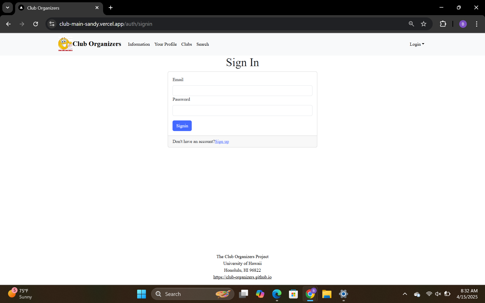
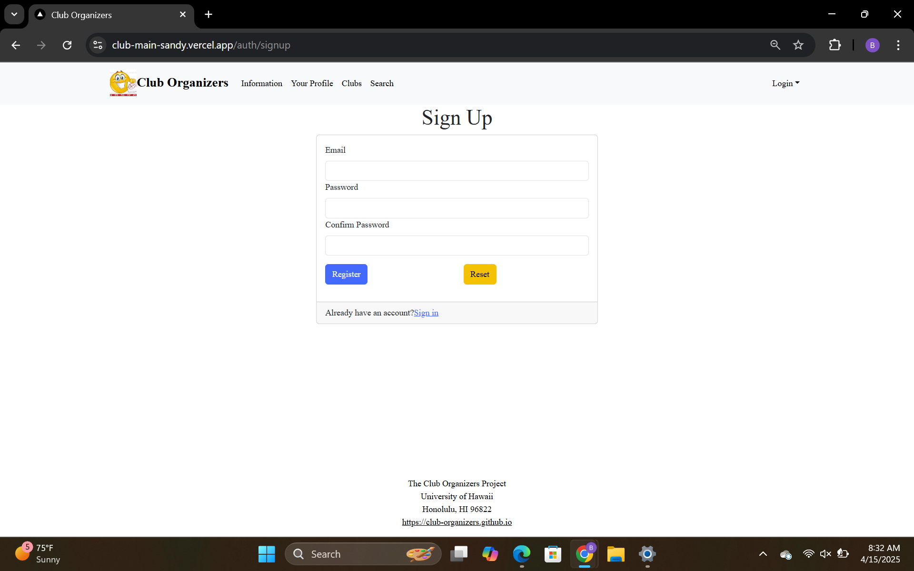

# Club Organizers

## 👨‍💻 Developer Guide

### 🛠 Setup Instructions

1. **Clone the repository:**  
   git clone https://github.com/club-organizers/club-main.git
   cd club-main
---

2. **Install dependencies:**
   npm install
   Create a .env.local file with your environment variables:
---

3. **Create a .env.local file with your environment variables**
   NEXT_PUBLIC_SUPABASE_URL=your_supabase_url
   NEXT_PUBLIC_SUPABASE_ANON_KEY=your_anon_key
---

4. **Run the development server:**
   npm run dev
---

 　**✅ Running Tests**
  To run Playwright tests and check for ESLint issues:
    npx playwright test
    npm run lint
   
---

## Table of contents

 * [Overview](#overview)
 * [Approach](#approach)
 * [Use Cases](#use-cases)
 * [Additional Implementation](#additional-implementation)
 * [Organization Links](#organization-links)
 * [Milestone 1](#milestone-1)
 * [M2 Preview](#m2-preview)
 * [Landing Page](#landing-page)
 * [User Login Page](#user-login-page)

## Overview
Club Organizers is a centralized platform dedicated to showcasing the diverse range of student organizations at the University of Hawaiʻi at Mānoa. With over 150 Registered Independent Organizations (RIOs) on campus, students have countless opportunities to get involved, connect with others, and pursue their interests. However, finding clear and up-to-date information about these organizations can be a challenge. Club Organizers aims to bridge that gap by offering an easy-to-navigate space where students can discover clubs, access contact details, stay updated on events, and engage with the vibrant UH Mānoa community.

## Approach
Club Hub features three distinct user roles, all accessible through UH ID login.
* Students and general users can explore the club directory, discover new organizations, and find ways to get involved.
* Club Administrators have special access to manage their organization's profile, keeping information up to date for potential members.
* Super Administrators oversee the platform, ensuring content remains appropriate and accurate. They also have the authority to assign Club Admin privileges to eligible users.

The website will include the following pages:
* Landing Page
  * Main directory to other pages
  * Includes a few organizations in the middle
* Information Page
  * A brief summary about the purpose of the website
* Your Profile Page
  * Displays the user's information and profile
* Clubs Page
  * A list of clubs the user can join
* Search Page
  * Allows the user to search for any clubs that they may be interested in
* Login Pages
  * Sign in
  * Sign up

## Use Cases
* New user gets to the landing page, goes to login, gets to user home page, sets up profile.
* Admin goes to landing page, logs in, moderates club page
* Club admin user goes to landing page, logs in, goes to club page, edits page

## Additional Implementation
Once the webpage has been implemented, our team will try work on more technical features, including:
* User comments and reports
 * User may be able to comment on organizations or report inappropriate activities
* Notify and email users about club "expiration dates"
* Add tags that users can use to search

## Organization Links
Source: [Click Here](https://github.com/club-organizers)

Mockup Website: [Click Here](https://sites.google.com/hawaii.edu/cluborganizers/landing-page)

Team Contract: [Click Here](https://docs.google.com/document/d/1zwaHmw8kk4Dnj7AcKQ1AbLDW_A7vJOKKQtOJAw8rHTU/edit?usp=sharing)

M1 Project Board: [Click Here](https://github.com/orgs/club-organizers/projects/2/views/1)

Vercel Deployment: [Click Here](https://club-main-sandy.vercel.app)

## Milestone 1
For Milestone 1, our team created basic HTML mock-up pages to visualize the initial layout and structure of our website. 

Milestone 1 Project Board: [Click Here](https://github.com/orgs/club-organizers/projects/2/views/1)

  

## M2 Preview
For Milestone 2, our team will focus on implementing:
* focused on implementing dynamic club pages
* database integration for reading and writing data
* continuous integration with automated testing.

M2 Project Board: [Click Here](https://github.com/orgs/club-organizers/projects/4)

## M3 Preview
For Milestone 3, our team will focus on implementing:
* something
* something
* something 

M3 Project Board: [Click Here](https://github.com/orgs/club-organizers/projects/7)

## Landing Page

  

## Information Page

  

## Sign-In Page

  

## Sign-Up Page

  

