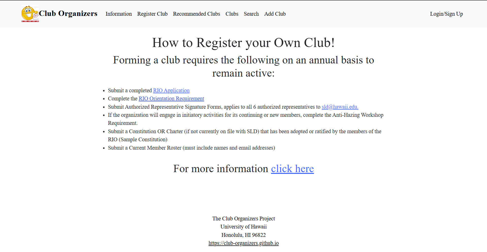

# Club Organizers

* Playwright tests ensure that all core pages (Landing, Clubs, Info, etc.) load properly and that forms (e.g. club submission forms) function correctly with valid input.

## Table of contents

 * [Overview](#overview)
 * [Approach](#approach)
 * [Use Cases](#use-cases)
 * [Additional Implementation](#additional-implementation)
 * [Developer Guide](#developer-guide)
 * [Organization Links](#organization-links)
 * [Milestones](#milestones)
 * [User Guide](#user-guide)
 * [Community Feedback](#community-feedback)
 * [Contact Us](#contact-us)

## Overview
Club Organizers is a centralized platform dedicated to showcasing the diverse range of student organizations at the University of Hawaiʻi at Mānoa. With over 150 Registered Independent Organizations (RIOs) on campus, students have countless opportunities to get involved, connect with others, and pursue their interests. However, finding clear and up-to-date information about these organizations can be a challenge. Club Organizers aims to bridge that gap by offering an easy-to-navigate space where students can discover clubs, access contact details, stay updated on events, and engage with the vibrant UH Mānoa community.

## Approach
Club Hub features three distinct user roles, all accessible through UH ID login.
* Students and general users can explore the club directory, discover new organizations, and find ways to get involved.
* Club Administrators have special access to manage their organization's profile, keeping information up to date for potential members.
* Super Administrators oversee the platform, ensuring content remains appropriate and accurate. They also have the authority to assign Club Admin privileges to eligible users.

The website will include the following pages:
* Landing Page
  * Main directory to other pages
  * Includes a few organizations in the middle
* Information Page
  * A brief summary about the purpose of the website
* Your Profile Page
  * Displays the user's information and profile
* Clubs Page
  * A list of clubs the user can join
* Search Page
  * Allows the user to search for any clubs that they may be interested in
* Login Pages
  * Sign in
  * Sign up

## Use Cases
* New user gets to the landing page, goes to login, gets to user home page, sets up profile.
* Admin goes to landing page, logs in, moderates club page
* Club admin user goes to landing page, logs in, goes to club page, edits page

## Additional Implementation
Once the webpage has been implemented, our team will try work on more technical features, including:
* User comments and reports
 * User may be able to comment on organizations or report inappropriate activities
* Notify and email users about club "expiration dates"
* Add tags that users can use to search

## Developer Guide

### 🛠 Setup Instructions

1. **Clone the repository:**  
   git clone https://github.com/club-organizers/club-main.git
   cd club-main
---

2. **Install dependencies:**
   npm install
   Create a .env.local file with your environment variables:
---

3. **Create a .env.local file with your environment variables**
   NEXT_PUBLIC_SUPABASE_URL=your_supabase_url
   NEXT_PUBLIC_SUPABASE_ANON_KEY=your_anon_key
---

4. **Run the development server:**
   npm run dev
---

 　**✅ Running Tests**
  To run Playwright tests and check for ESLint issues:
    npx playwright test
    npm run lint
   
---

## Organization Links
Source: [Click Here](https://github.com/club-organizers)

Mockup Website: [Click Here](https://sites.google.com/hawaii.edu/cluborganizers/landing-page)

Team Contract: [Click Here](https://docs.google.com/document/d/1zwaHmw8kk4Dnj7AcKQ1AbLDW_A7vJOKKQtOJAw8rHTU/edit?usp=sharing)

M1 Project Board: [Click Here](https://github.com/orgs/club-organizers/projects/2)

M2 Project Board: [Click Here](https://github.com/orgs/club-organizers/projects/4)

M3 Project Board: [Click Here](https://github.com/orgs/club-organizers/projects/7)

Vercel Deployment: [Click Here](https://club-main-sandy.vercel.app)

## Milestones
### Milestone 1
For Milestone 1, our team created basic HTML mock-up pages to visualize the initial layout and structure of our website. 

M1 Project Board: [Click Here](https://github.com/orgs/club-organizers/projects/2)

  

### Milestone 2
For Milestone 2, our team focused on implementing:
* dynamic club pages
* database integration for reading and writing data
* continuous integration with automated testing

M2 Project Board: [Click Here](https://github.com/orgs/club-organizers/projects/4)

  

### Milestone 3
For Milestone 3, our team will focus on implementing:
* Editing and adding pages made exclusively for admin 
* User webpage unable to edit club data
* Personal user changes

M3 Project Board: [Click Here](https://github.com/orgs/club-organizers/projects/7)

## User Guide
### Landing Page
When you open the application, users will be welcomed with our landing page. It has a brief description of the website and allows users to discover more clubs with a click of a button at the bottom. 

  

### Information Page
The Information tab will lead users to a page that gives more information about the purpose of our website. 

  

### Register Club Page
If users wish to learn how to make a new official club, the Register Club tab will open up to a page that will give instructions and links to help guide them. 

  

### Recommended Clubs
When users press the Recommended Clubs tab, they can use a drop-down list with the different types of clubs. Users simply select one, and they will be shown all of the different clubs that match said type. If they see a club they are interested in, they can view details about it. 

  

### Clubs Page
If users wish to see all of the clubs available at UH, they can click on the Clubs tab, which will show all of the clubs in alphabetical order. 

  

### Search Page
If users would rather search for a specific club, they can go to the Search tab and search for a club using the name or description. 

  

### Add Club Page
To add a club, users can refer to the Add Club tab. Simply providing the following information and adding the club will add it to the club database. 

  

### Log In Page
If users have an account, they can log in using their email and password. 

  

## Sign-Up Page
If users have yet to make an account, they can sign up by providing their email and a password. 

  

## Community Feedback
* "I feel that the club, search, and reccomended clubs pages could merged into a single page so that there is less bloat in the Navbar"
* "I think that a club member count could be a useful addition"

## Contact Us

<table>
  <tr>
    <td align="center">
      <a href="https://reifukuzawa.github.io/">
         Rei
      </a>
    </td>
    <td align="center">
      <a href="https://kenji-ks.github.io/">
         Kenji
      </a>
    </td>
    <td align="center">
      <a href="https://peter-bel.github.io/">
         Peter
      </a>
    </td>
    <td align="center">
      <a href="https://jaaronbc.github.io/">
         Jaaron
      </a>
    </td>
    <td align="center">
      <a href="http://bkumalaa.github.io/">
         Brandon
      </a>
    </td>
  </tr>
</table>

